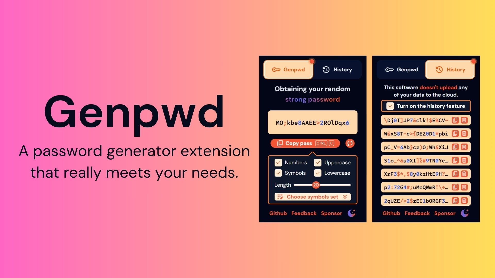

    

  
  
  

# Genpwd

🔑 A password generator that really meets your needs.

Special thanks to **_[plasmo](https://github.com/PlasmoHQ/plasmo)_** for taking the frustration out of browser extension development for me.

> This project has been developed and is waiting for approval by the browser extension store.

## Features

1. Well-designed two sets of themes in light and dark modes.
2. Support options such as password length, whether it contains symbols/uppercase letters/lowercase letters/numbers, etc.
3. The symbol character set used is configurable.
4. Optional password history.

## Preview

## Contribution

Please make sure to read the [Contributing Guide](./.github/CONTRIBUTING.md) before making a pull request.

This includes instructions on how to setup development environment, test extensions, and build the final product.
